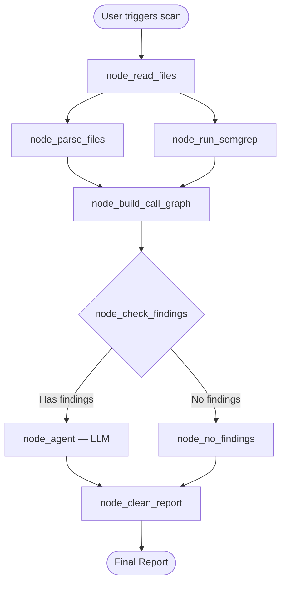

# 🔄 Workflow — End-to-End Pipeline

> How data flows from a raw repository path to a structured vulnerability report.

---

## The Big Picture

When a scan is triggered, the **orchestrator** (`app/agents/orchestrator.py`) drives the pipeline as a LangGraph state machine. Here's exactly what happens, step by step:



---

## Step-by-Step Breakdown

### Step 1: Read Files (`file_reader.py`)
**Node**: `node_read_files`

- Takes the `repo_path` from the scan request
- Walks the entire directory tree using `os.walk()`
- **Filters out** junk directories (`node_modules`, `.git`, `__pycache__`, `.venv`, etc.)
- **Keeps** source files (`.py`, `.js`, `.ts`, `.go`, `.java`, `.rs`, etc.), config files (root level only), and dependency files
- **Skips** files larger than 500KB
- Reads each file's raw content into memory
- **Outputs**: A dict with `files` (path → content), `structure` (directory → file list), and `metadata`

### Step 2a: Parse Files (`ast_parser.py` + `treesitter_parser.py`)
**Node**: `node_parse_files` — **runs in parallel** with Step 2b

- Iterates over every file from Step 1
- Routes each file to the correct parser:
  - `.py` files → `ast_parser.parse_python_file()`
  - `.js`, `.ts`, `.go`, `.java`, `.rs`, etc. → `treesitter_parser.parse_file()`
  - Other extensions (`.json`, `.yaml`, etc.) → **skipped** (not parseable code)
- Each parser returns the **exact same schema** — this is a critical design decision
- **Outputs**: A list of per-file parse result dicts

### Step 2b: Run Semgrep (`semgrep_runner.py`)
**Node**: `node_run_semgrep` — **runs in parallel** with Step 2a

- Checks if `semgrep` is installed on the system
- Builds and runs the `semgrep` CLI command as a subprocess
- Parses the JSON output
- Extracts, deduplicates, and caps findings
- **Outputs**: A structured findings dict with severity summary

### Step 3: Build Call Graph (`call_graph.py`)
**Node**: `node_build_call_graph` — **fan-in point** (waits for both 2a and 2b)

- Merges progress events from both parallel branches
- Takes all parse results from Step 2a
- Builds a **symbol table** (function/class name → file where it's defined)
- Builds a **file-level import graph** (which file imports which file)
- Builds **function-level call edges** (which function calls which function, and can we resolve it?)
- Detects **circular imports** using DFS
- Computes **per-file metrics** (in-degree, out-degree, is it an entry point? a utility?)
- Identifies **hotspots** (most-imported files)
- **Outputs**: A rich graph dict with all relationships

### Step 4: Check Findings
**Node**: `node_check_findings`

- Looks at two things:
  1. Did Semgrep find any findings?
  2. Did any file have security flags set (like `uses_eval`, `has_sql_string`)?
- If either is true → route to the LLM agent
- If neither → skip the LLM entirely (saves API calls)

### Step 5a: LLM Agent (conditional)
**Node**: `node_agent`

- Builds a rich context prompt from:
  - Semgrep findings
  - AST security flags
  - Call graph hotspots
  - Circular imports
- Sends it to the Gemini LLM
- Parses the structured JSON response
- **Outputs**: Enriched findings with severity, exploitability, and fix recommendations

### Step 5b: No Findings (conditional)
**Node**: `node_no_findings`

- Returns a clean "no vulnerabilities found" result
- Skips the LLM call entirely

### Step 6: Assemble Report
**Node**: `node_clean_report`

- Combines everything into a final report:
  - Scan metadata (ID, timestamp, repo path)
  - Stats (files scanned, languages, finding counts by severity)
  - All findings
  - Raw Semgrep data
  - Call graph summary
  - Risk score

---

## Parallel Execution Model

Steps 2a and 2b run **in parallel** — this is a key performance optimization. The orchestrator uses LangGraph's fan-out/fan-in pattern:

```
node_read_files
      │
      ├──→ node_parse_files    (writes to parse_progress)
      │
      └──→ node_run_semgrep    (writes to semgrep_progress)
              │
              ├── Both finish ──→ node_build_call_graph (merges progress)
```

To avoid **concurrent state write conflicts**, each parallel branch writes to its own progress key:
- `node_parse_files` → `parse_progress`
- `node_run_semgrep` → `semgrep_progress`

The `node_build_call_graph` fan-in node merges them both into the main `progress` list.

---

## Data Flow Summary

```
repo_path (string)
    │
    ▼
file_reader_out = {files: {path: content}, structure: {...}, metadata: {...}}
    │
    ├──▶ parse_results = [{filepath, functions, classes, imports, calls, security_flags, stats}, ...]
    │
    └──▶ semgrep_out = {findings: [...], severity_summary: {...}, stats: {...}}
    │
    ▼
call_graph_out = {symbol_table, import_graph, call_edges, hotspots, circular_imports, ...}
    │
    ▼
agent_out = {findings: [...], summary, risk_score, most_vulnerable_file}
    │
    ▼
final_report = {scan_id, stats, findings, call_graph_summary, risk_score, ...}
```

---

## Progress Streaming

The orchestrator streams progress events to the frontend via **Server-Sent Events (SSE)**. Each stage emits events like:

```json
{"stage": "file_reader", "message": "Found 42 files", "data": {"total_files": 42}, "timestamp": "..."}
{"stage": "ast_parser", "message": "Parsed src/auth.py", "data": {}, "timestamp": "..."}
{"stage": "semgrep", "message": "Semgrep complete", "data": {"findings": 5}, "timestamp": "..."}
{"stage": "complete", "message": "Scan finished", "data": {"risk_score": 7.2}, "timestamp": "..."}
```

The final event always has `"stage": "final_report"` and contains the complete report.
